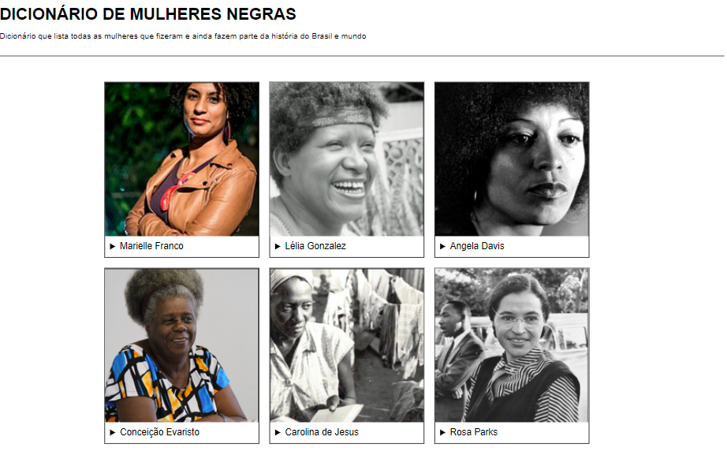

# Dicionário de Mulheres Negras📚

Este projeto tem como objetivo listar todas as mulheres negras que fizeram e ainda fazem parte da história do Brasil e mundo. Utilizei HTML, CSS e JavaScript para criar uma interface intuitiva e fácil de usar.

## Recursos

- Lista de mulheres negras importantes
- Detalhes sobre as realizações e contribuições de cada mulher.

## Como utilizar

1. Clone o repositório ou faça o download do arquivo zip
2. Abra o arquivo index.html em seu navegador preferido
3. Explore as diferentes páginas e recursos do dicionário

## Contribua

Se você tem alguma sugestão ou correção a fazer, sinta-se à vontade para abrir uma issue ou enviar um pull request. Juntos, podemos criar um recurso ainda melhor para celebrar as mulheres negras incríveis deste mundo.

## Tecnologias Utilizadas

- HTML
- CSS
- JavaScript

## Esse é o resultado final:

Projeto Final do curso EuProgramo Front-End II da Programaria. Clique e veja: [Dicionário de Mulheres Negras](https://raquel-maia.github.io/dicionario/)
